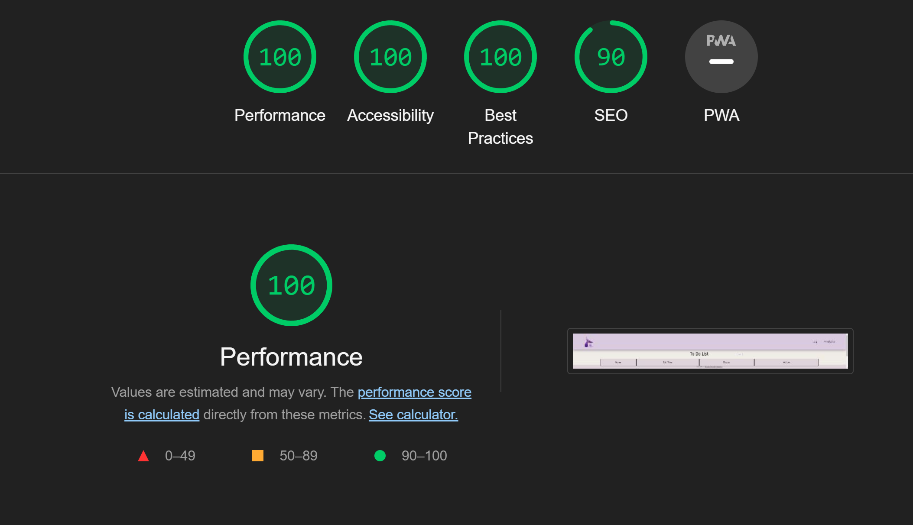

# cse110-fa22-group21

## Welcome To Our Repo

We are a 10 member team working on a CRUD application using HTML, CSS and JavaScript. The team consists of 2 team leads and 8 developers. Our mentor is Navya Shetty. Here is a link to the [team page](admin/team.md). If you are looking to get started in Team Ursula then be sure to read our [onboarding](admin/onboard.md) documentation!

## Project

We will create a CRUD application using HTML, CSS and JavaScript that will allow users to create, read, update and delete items of their choosing. We are hosting the application on [GitHub Pages.](https://cse110-fa22-group21.github.io/cse110-fa22-group21/)

Here is our [public video](https://www.youtube.com/watch?v=iHkScgr6TE8&feature=youtu.be) and
here is our [private video](https://www.youtube.com/watch?v=b8O0ej4yqe0).

As aspiring software developers, we strive for our work to be professional, high quality and accessible. We will be making use of the lighthouse developer tool as a way to track and measure the quality of our code. Here is the latest [lighthouse report](admin/other/lighthousereport.pdf) of our completed website.

## Team

-   Team Leader - Ji Hoon Kim
-   Team Leader - Michael Ruddy
-   Developer - Linh Ngyuen
-   Developer - Joyce Weng
-   Developer - Moritz Wagner
-   Developer - Nikki Rejai
-   Developer - Tianya Zhan
-   Developer - Vicky Chou
-   Developer - Ziting Xiong
-   Developer - Melvyn Tan

## JSDocs Documentation

JSDocs ocumentation can be found at
https://cse110-fa22-group21.github.io/cse110-fa22-group21/docs/index.html
