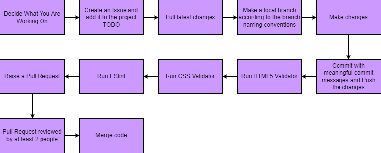

# Current Pipeline In Place

## Programming Protocols/Styling
This has been documented and created in [CodingManifest.md](CodingManifest.md).

## Upon Every Push to any Branch
### HTML5 and CSS Validation
HTML5 & CSS Validator: https://github.com/marketplace/actions/html5-validator  
We have incorporated a HTML5 & CSS Validator for the workflow of this project. At every pull request, any HTML5 and CSS files will be checked for validation. If there are any errors, the workflow will return an error.

## Upon a Pull Request to Main
### Linter
ESlint: https://github.com/marketplace/actions/eslint-js-ts-action  
We have incorproated a linter, ESlint, that checks for syntax errors.

### Approvals
There must be a minimum of 2 approvals/reviews from the team before the branch can be merged into main. All comments should be resolved before merging.

# Planned/In-Progress 

## JSON Validator
JSON Validator: https://github.com/marketplace/actions/validate-json  
We are planning to incorporate a JSON Validator but only we will only implement it once we begin working with the local storage. Estimated implementation in Week 8-9.

## JSdocs 
We are planning to incorporate JSdocs to allow us to annotate our JavaScript files as well adding documentation to allow for easier readability. We have to implement this in Week 8 when we start to use JavaScript. 

## Unit & E2E Testing
We are planning to incorporate this once we have finished the lab for week 8 as this will give us a better idea of what we are doing. We hope to implement this by the end of Week 8 or during Week 9. 

## Functional Testing
We are also planning to incorporate this around week 8-9 as well since that is when most of the teams will start to finish coding. Once they are done coding, we can write the functional tests.
