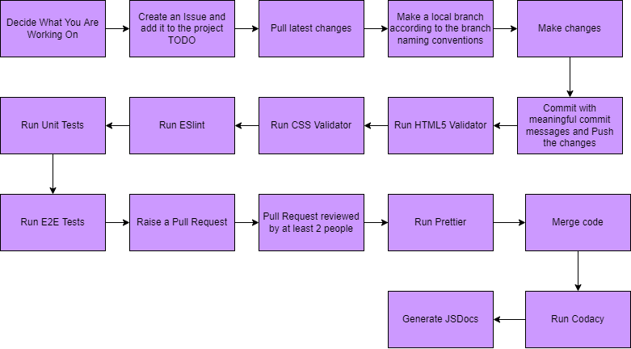

# Phase 2: Current Pipeline In Place

## Programming Protocols/Styling
This has been documented and created in [CodingManifest.md](CodingManifest.md).

## Upon Every Push to any Branch
### HTML5 and CSS Validation
HTML5 & CSS Validator: https://github.com/marketplace/actions/html5-validator  
We have incorporated a HTML5 & CSS Validator for the workflow of this project. At every push, any HTML5 and CSS files will be checked for validation. If there are any errors, the workflow will return an error.

### Linter
ESlint: https://github.com/marketplace/actions/eslint-js-ts-action  
We have incorporated a linter, ESlint, that checks for syntax errors. The workflow will run on every push.

### Unit Testing
On every push, there will be automated unit testing for the javascript files. We are using Jest to perform unit testing.

### E2E Testing
On every push, there will be automated end-to-end testing. We are using Puppeteer and Jest to achieve this.

## Upon a Pull Request to Main
### Approvals
There must be a minimum of 2 approvals/reviews from the team before the branch can be merged into main. All comments should be resolved before merging.

### Prettier
We have incorporated Prettier to enforce our programming protocols upon every pull request to main. Example things that Prettier will enforce is tabs should be used instead of spaces.
## After Merging to Main
### Codacy
We have incorporated Codacy as a form of code quality. Codacy will evaluate the repository upon every push to main. We have selected some coding styles/standards to follow which Codacy will then return a grade to us based on how we followed the styling. We have linked the grade we achieved to our README.

### JSDocs Generation
We have automated JSDocs to automatically generate documentation of our javascript files upon every push to main. The generated documentations is available in the docs folder of the repository or at the bottom of the README.

# Planned/In-Progress 
## JSON Validator
JSON Validator: https://github.com/marketplace/actions/validate-json  
In Phase1, we initially thought of implementing a JSON Validator but we have decided to only implement if we have extra time as it is not a necessary check to have.
