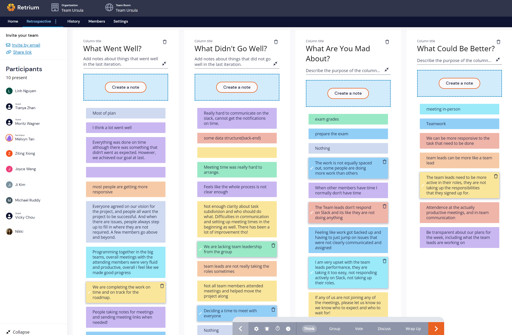
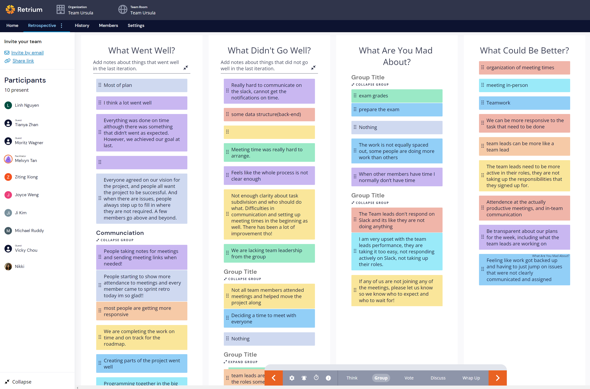
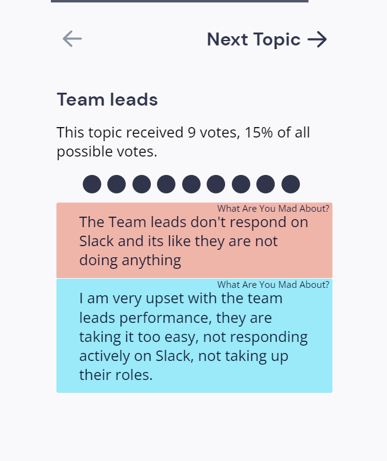
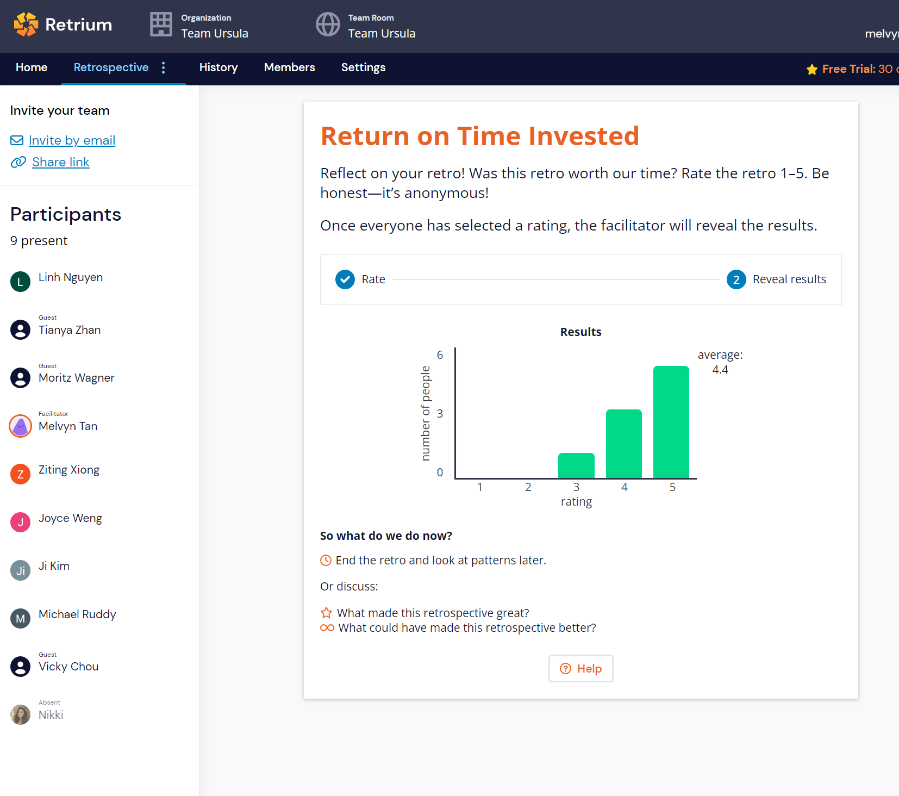

# Retrospective 11/13/2022

## Meeting Minutes & Location

7:00pm Zoom

## Minutes

7:00pm - 7:30pm

## Attendance List

-   [x] Ji Hoon Kim
-   [x] Michael Ruddy
-   [x] Linh Nguyen
-   [x] Joyce Weng
-   [x] Moritz Wagner
-   [x] Nikki Rejai
-   [x] Tianya Zhan
-   [x] Vicky Chou
-   [x] Ziting Xiong
-   [x] Melvyn Tan

## Agenda

-   Use Retro to conduct retrospective
    -   Identify what went well and what didn’t
    -   Reflect on improvements for the next sprint
-   Note high points and keep artifacts from the retrospective for your sprint planning and to include in your Status Video which is a separate assignment.

## Link to the Retrospective

https://app.retrium.com/team-room/4c4d2144-2bda-4177-966a-c63896a554ed/history/7b03ba3b-1a08-43aa-8be2-a5c71b550675

## Screen Captures taken During Retrospective

### Initial Ideas

### Grouping Ideas

### Most Voted Opinion

### Ratings

## Takeaways

### What went well:

1. Programming together and staying on track with the roadmap.
2. People starting to be more responsive.

### Improvements:

1. Team leads need to be more active, not taking up responsibilities.
2. Hard to communicate on slack and cannot get notifications on time.
3. Not all team members attended meetings and helped move the project along.
4. Deciding on a time to meet with everyone.
5. The work is not equally spaced out, some people are doing more work than others.
